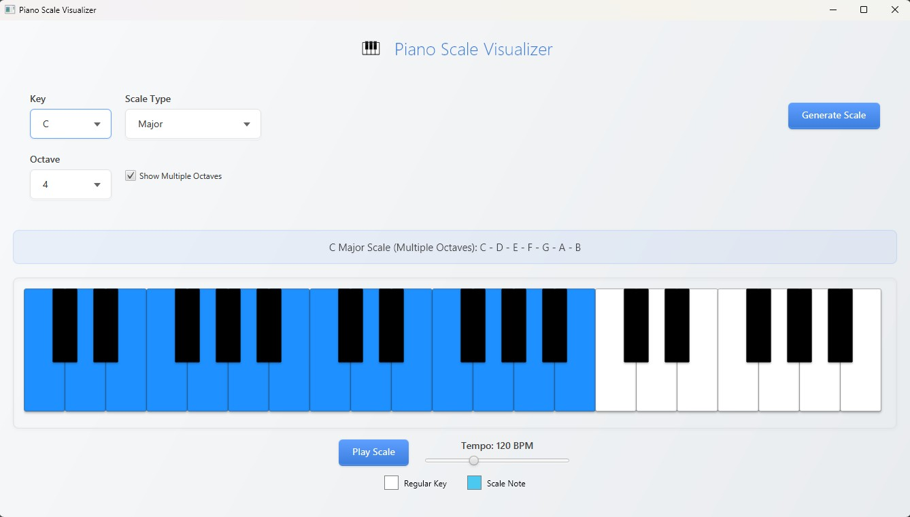

# Piano Scale Visualizer

An application for visualizing and playing piano scales.

## Demonstration

## Overview

This application provides a visual representation of a piano keyboard and highlights the notes of a selected scale. It allows users to choose a root note, scale type, and octave, and then displays the corresponding scale on the piano. Additionally, the application can play the selected scale using MIDI sounds.

## Features

-   Interactive piano keyboard display
-   Selection of root note and scale type
-   Octave selection
-   Selection for single or multi octave display
-   Highlighting of scale notes on the keyboard
-   MIDI playback of scales with adjustable tempo
-   Visually appealing and modern user interface

## Usage

1.  Select a root note from the "Key" dropdown menu.
2.  Select a scale type from the "Scale Type" dropdown menu.
3.  Choose an octave from the "Octave" dropdown.
4.  Use multi octave or single octave
5.  Click piano keys to play sound
6.  Adjust the tempo using the tempo slider.
7.  Click the "Play Scale" button to hear the selected scale.

## Dependencies

-   JavaFX
-   javax.sound.midi

## Installation

1.  Clone the repository.
2.  Ensure you have Java and JavaFX installed.
3.  Compile the source files.
4.  Run the application.

## Class Details

-   `ScaleVisualizer.java`: The main application class. It sets up the user interface, including combo boxes for selecting the root note, scale type, and octave. It also handles the display of the piano keyboard and the highlighting of scale notes. This class uses JavaFX for creating the UI elements and handling user interactions.
-   `MidiPlayer.java`: Manages MIDI functionality. It initializes the synthesizer, allows playing individual notes, and handles resource cleanup upon application closure. Utilizes `javax.sound.midi` for MIDI output.
-   `PianoKey.java`: Defines the properties and behavior of individual piano keys. It manages the visual representation of the keys and handles user interactions to play the corresponding notes. It also sets the active color when a note is part of the scale.
-   `PianoKeyboard.java`: Creates and manages the piano keyboard display. It arranges `PianoKey` objects and handles highlighting notes based on selected scales.
-   `ScalePlayer.java`: Plays the notes of a selected scale using the `MidiPlayer`. It converts scale notes to MIDI numbers and controls the tempo using threads.
-   `ScaleGenerator.java`: Generates the notes for various scales based on a predefined set of scale formulas. It includes methods to retrieve available scales and generate notes for a given root, scale type, and octave.

## Additional Notes

-   The application uses a modern, visually appealing interface created with JavaFX, including custom CSS styling.
-   Error handling is included to gracefully manage MIDI initialization failures and missing resources.
-   The application icon is located in the `/icons` directory.
-   The display updates dynamically to reflect the selected scale and root note
